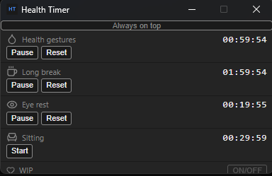

# Health Timer

A compact desktop app that helps you maintain healthy work habits by tracking multiple break reminders at a glance.



## What it does

Health Timer sits in a small, always-visible window and runs four independent countdown timers, each covering a different aspect of workplace wellbeing:

| Timer | Default duration | Purpose |
|---|---|---|
| Health gestures | 1 hour | Remind yourself to stretch, drink water, or move |
| Long break | 2 hours | Step away from the screen entirely |
| Eye rest | 20 minutes | Follow the 20-20-20 rule (look 20 ft away for 20 s) |
| Sitting | 30 minutes | Stand up or change posture |

When a timer reaches zero, its icon flashes. Click the icon to dismiss the alert and reset the timer.

Each timer duration is editable: click the time display while the timer is stopped and type a new value (formats accepted: `mm:ss`, `h:mm:ss`).

The **Always on top** button pins the window above all other apps so it stays visible while you work.

## Installation

### macOS

1. Download the `.dmg` for your architecture from the [Releases](../../releases) page:
   - `HealthTimer-x.x.x-arm64.dmg` — Apple Silicon (M1/M2/M3/M4)
   - `HealthTimer-x.x.x-x64.dmg` — Intel
2. Open the `.dmg` and drag **Health Timer** to your Applications folder.
3. On first launch, macOS may show a security warning. Go to **System Settings → Privacy & Security** and click **Open Anyway**.

### Windows

1. Download `HealthTimer-Setup-x.x.x.exe` from the [Releases](../../releases) page.
2. Run the installer and follow the prompts.

## Building from source

**Prerequisites:** [Node.js](https://nodejs.org) 20+

```bash
git clone <repo-url>
cd health-timer
npm install
```

**Run in development mode:**

```bash
npm run dev
```

**Build a distributable installer:**

```bash
npm run package
```

The output is placed in `health-timer/dist/`. Note that macOS `.dmg` files must be built on macOS; Windows `.exe` installers must be built on Windows.

## Tech stack

- [Electron](https://www.electronjs.org/) — desktop shell
- [React](https://react.dev/) + [TypeScript](https://www.typescriptlang.org/) — UI
- [electron-vite](https://electron-vite.org/) — build tooling
